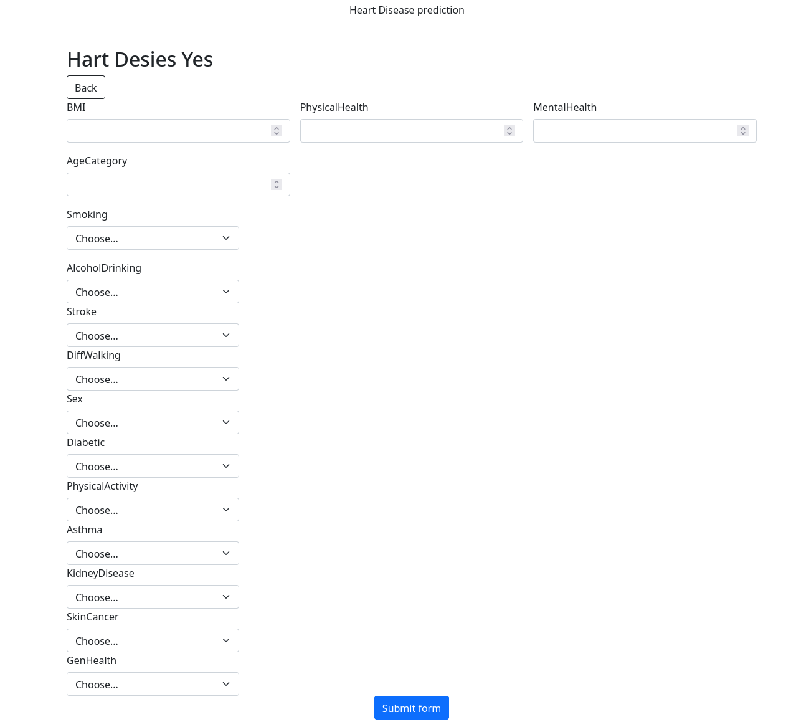

# Heart Disease Prediction

## Description
 
This project aims to predict the presence or absence of heart disease using a decision tree model. The decision tree algorithm is used to analyze a set of medical indicators and classify patients as either having heart disease or not.

The project consists of two main components: the model building phase and the web application for user interaction.

## Model Building

The decision tree model is trained on a dataset containing various features such as age, gender, blood pressure, cholesterol levels, and other relevant medical indicators. The scikit-learn library is utilized to implement the decision tree algorithm, specifically the CART (Classification and Regression Trees) or C4.5 algorithm.

The dataset is preprocessed by handling missing values, removing duplicates, and addressing outliers. Feature engineering techniques may be employed to transform or create new features that could enhance the model's performance.

The model is evaluated using metrics such as accuracy, precision, and recall to assess its effectiveness in predicting heart disease. Hyperparameters can be adjusted to optimize the model's performance.

## Web Application

The web application is developed using Flask, HTML, CSS, and Bootstrap. Flask is a lightweight web framework in Python, providing the necessary infrastructure to create a user-friendly interface for interacting with the heart disease prediction model.

HTML, CSS, and Bootstrap are used for designing and styling the web pages. Bootstrap provides a responsive and aesthetically pleasing layout, ensuring a seamless user experience across different devices.

Users can input their medical information, such as age, gender, blood pressure, cholesterol levels, and other relevant indicators, into the web application. The decision tree model will then make a prediction on whether the user is likely to have heart disease or not.

## Demo Image

This image showcases the web application's user interface, where users can enter their medical information and obtain the heart disease prediction.

## Getting Started

To run the project locally, follow these steps:

1. Clone the repository: `git clone https://github.com/your-repo.git`
2. Install the required dependencies: `pip install -r requirements.txt`
3. Run the Flask application: `python app.py`
4. Access the web application through your browser at `http://localhost:5000`

## References

- [scikit-learn Documentation](https://scikit-learn.org/)
- [Flask Documentation](https://flask.palletsprojects.com/)

